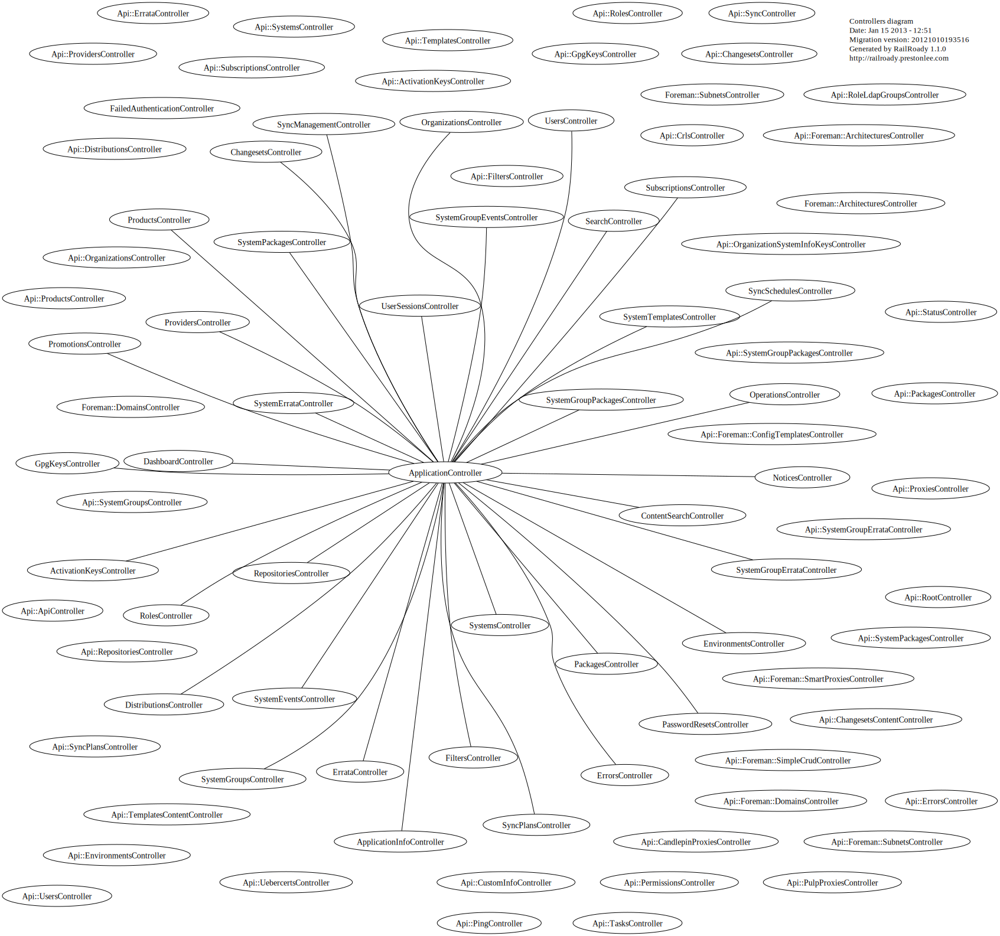

# Graphs

*Note: If you do not see any graph images please generate them, see bottom of this page.*

## Models brief

  

## Models complete

  

## Controllers brief

  

## Controllers complete

  

## How to generate and update these graphs

- enable `railroady` gem in `bundler.d/development.rb`
- generate svg graphs

      !!!txt
      bundle exec rake diagram:all

- move them to graphs folder

      !!!txt
      mv -f doc/*.svg doc/graphs
